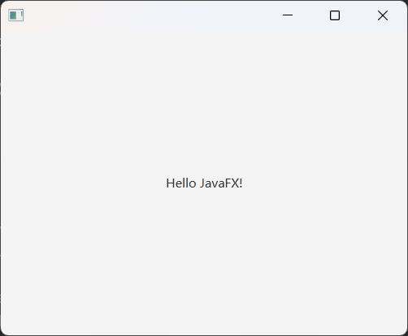
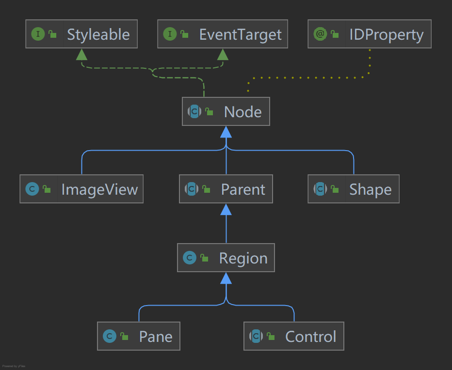
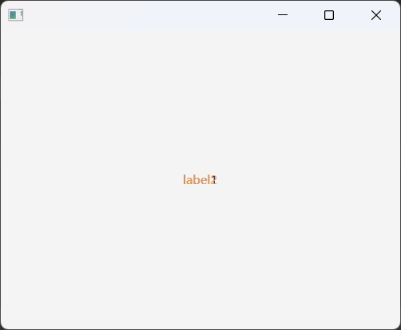
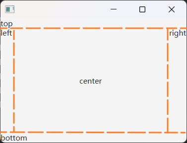
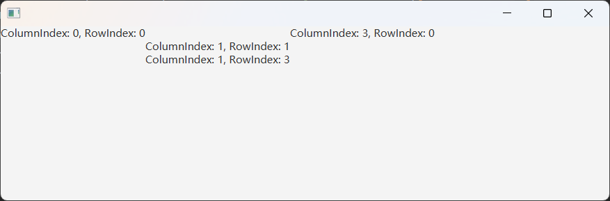
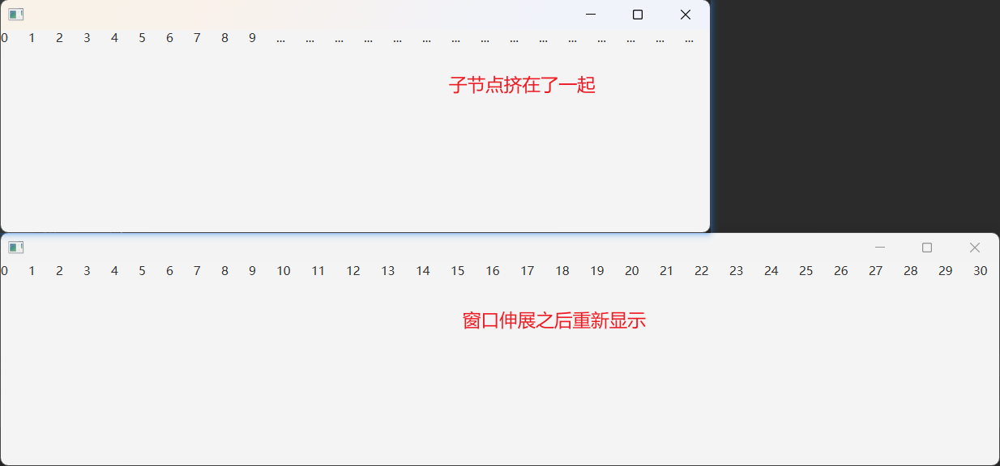
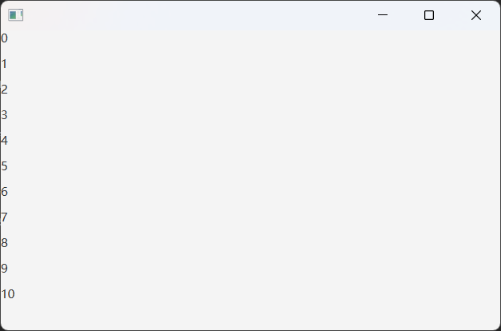
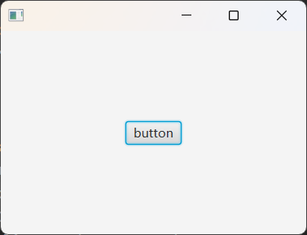
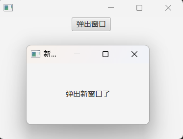
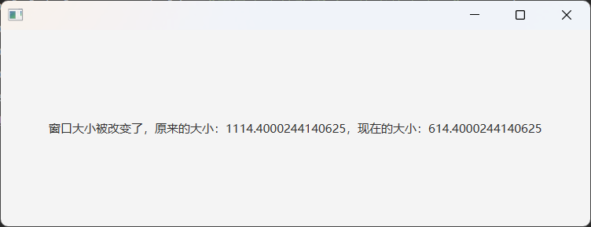

最近，因为有一个小工具需要用到 UI 界面，稍微查了一下，发现 JavaFX 是目前比较流行的 UI 框架，就选择了它来做。由于此前没有接触过，加上 JavaFX 的相关资料也比较少，因此在这里总结分享一下。

## JavaFX 简介
JavaFX 是一个用于创建富客户端应用程序的 UI 框架，它提供了丰富的图形和多媒体功能，以及现代的用户界面设计元素。JavaFX 最初由 Sun Microsystems 开发，后来由 Oracle 继续推进。  

JavaFX 具有以下的特点和功能：  
1. 现代化的图形库： JavaFX 提供了现代化的图形库，支持丰富的图形渲染、动画效果和多媒体处理。它使用了硬件加速技术，提供更流畅的用户界面体验。
2. FXML 和 Scene Builder： FXML 是一种用于定义用户界面的声明性 XML 语言。Scene Builder 是一个可视化工具，允许开发者以拖放方式设计用户界面，然后使用 FXML 进行布局。
3. 丰富的 UI 控件： JavaFX 提供了丰富的预建 UI 控件，包括按钮、标签、文本框、表格视图等。这些控件可以方便地用于构建各种类型的应用程序。
4. CSS 样式化： JavaFX 允许使用 CSS 样式表对用户界面进行样式化，使得界面设计更加灵活和易于维护。
5. 事件处理： JavaFX 支持事件驱动编程，开发者可以通过注册事件处理器来响应用户的交互，例如点击、键盘输入等。
6. 并发和多线程： JavaFX 提供了方便的 API，支持并发编程和多线程操作，使得开发者可以在应用程序中实现并行和异步操作。
7. 跨平台支持： JavaFX 应用程序可以轻松地在不同平台上运行，包括 Windows、macOS 和 Linux。这得益于 Java 虚拟机（JVM）的跨平台性。
8. 集成性： JavaFX 可以与其他 Java 技术和库无缝集成，如 JDBC（Java 数据库连接）、Web Services 等。

JavaFX 在 JDK11 之前是 JavaSE 的一部分，但从 JDK11 开始，它被移出了 JDK，作为一个独立的模块。因此，JDK11 之后的版本，要使用 JavaFX，需要自行导入。


## 启动 JavaFX 程序 
我们先来看一下一个 JavaFX 程序的主类是怎么样的，它跟传统的 Java 程序有一点区别。     

```java
public class Main extends Application {
    public static void main(String[] args) {
        launch(args);
    }

    @Override
    public void start(Stage stage) throws Exception {
        Scene scene = new Scene(new StackPane(new Label("Hello JavaFX!")), 400, 300);
        // 设置界面的场景
        stage.setScene(scene);
        // show() 方法显示主界面
        stage.show();  
    }
}
```

从上面的程序中可以看到，使用 Java FX 的时候，要让主类继承 `Application`。`Application` 是一个抽象类，需要实现 `start()` 方法，此外还需要在 `main` 方法中调用 `launch()` 方法。这里解释一下这两个方法：      
- 首先，`launch()` 方法是 `Application` 类中的静态方法，它是 JavaFX 应用程序的入口点，负责启动 JavaFX 运行时系统。   
- `start()` 方法实际上是我们真正写应用程序代码的地方，可以让我们自行发挥设计界面，其中方法参数 `Stage stage` 直译的话是舞台，实际上就是 UI 界面的主界面。一般来说，我们通过设置场景 `Scene` 来修饰界面，可以简单地类比为界面就是地板，场景就是毯子，那么后续要添加的组件就是道具，可以任意摆放在毯子上面。当我们想要切换界面的场景时，只需要调用界面的 `setScene()` 方法切换即可。而想要另开一个界面的时候，则需要新建一个 `Stage`。

上面这段程序运行的结果如下图所示。后续我们就可以在此基础上添加组件完成我们想要的 UI 界面。
<div align="center"></div>


## JavaFX 中组件的继承结构

接下来，我们来看一下 JavaFX 中组件的继承结构，对组件有一个总体的把握。当然，这只是其中一部分，更细的继承结构若有兴趣可以深入去研究。
<div align="center"></div>   

`Node` 类是所有组件的顶层抽象类，它实现了 `Styleable`、`EventTarget` 两个接口，以及有 `IDProperty` 注解注释。根据源文件所说，它是场景图节点的基类：Base class for scene graph nodes.    

在 `Node` 类下有多个子类（不止图中的三个），它们表示不同类型的节点。例如图中的 `Parent` 抽象类表示 JavaFX 中的有子节点类型，它可以包含其他节点，如 `ImageView`、`Shape` 等，在源文件中是这么描述的：The base class for all nodes that have children in the scene graph. 它的子类用于组织和布局组件，从而构建整个应用程序界面的层次结构。   

`Region` 继承了 `Parent`，是所有基于 JavaFX 节点的 UI 控件和所有布局容器的基类：Region is the base class for all JavaFX Node-based UI Controls, and all layout containers. 可以说，基本上我们使用到的组件都是它的子类。

`Pane` 和 `Control` 是 `Region` 的直接子类，分别对应组件的两大类别：布局和交互。布局组件是用于安排和组织用户界面元素的组件。交互组件是用于处理用户输入、响应用户操作和提供用户反馈的组件，比如鼠标点击。实际上，我们在自定义应用程序的过程中，主要关注的也就是 `Pane` 和 `Control` 以及它的子类。


## 布局组件

继承了 `Pane` 的布局组件有很多，这里只说几种，更多的布局组件若有兴趣可以自行了解。  

### StackPane

`StackPane` 是按照堆栈方式排列其子节点的布局容器，后添加的子节点位于上层，它允许子节点重叠，因此在需要在同一区域显示多个节点时非常有用。   

```java
@Override
public void start(Stage stage) throws Exception {
    Label label1 = new Label("label1");
    Label label2 = new Label("label2");
    label2.setStyle("-fx-text-fill: #ee9954;");
    StackPane stackPane = new StackPane();
    // 添加子节点
    stackPane.getChildren().addAll(label1,label2);
    Scene scene = new Scene(stackPane,400,300);
    stage.setScene(scene);
    stage.show(); 
}
```

这段程序的运行结果如下，可以看到，`label1` 和 `label2` 是重叠在一起的，并且，`label2` 是后添加的，显示在了上层。
<div align="center"></div>   


### BorderPane

`BorderPane` 是按照上、下、左、右、中心五个方向布局子节点的布局容器，即将内部分为了五个区域：`top`、`bottom`、`left`、`right`、`center`，每个区域默认的位置是左和上，子节点可以放到相应的位置。

```java
@Override
public void start(Stage stage) throws Exception {
    BorderPane borderPane = new BorderPane();
    borderPane.setTop(new Label("top"));
    borderPane.setBottom(new Label("bottom"));
    borderPane.setLeft(new Label("left"));
    borderPane.setRight(new Label("right"));
    borderPane.setCenter(new Label("center"));
    Scene scene = new Scene(borderPane, 300, 200);
    stage.setScene(scene);
    stage.show();
}
```

程序的运行结果如下，其中，橙色的虚线是我为了让各个区域显示清楚手动绘上去的。
<div align="center"></div> 


### GridPane

GridPane 是按照行和列的网格形式布局子节点的布局容器，它将内部分为了许多格子，我们可以自行设置子节点在哪个格子。但是，`GridPane` 设置的子节点的位置并不是绝对位置，而只是相对而言的。具体是怎么相对的，可以看下面的例子。

```java
@Override
public void start(Stage stage) throws Exception {
    GridPane gridPane = new GridPane();
    gridPane.add(new Label("ColumnIndex: 0, RowIndex: 0"),0,0);
    gridPane.add(new Label("ColumnIndex: 3, RowIndex: 0"),3,0);
    gridPane.add(new Label("ColumnIndex: 1, RowIndex: 1"),1,1);
    gridPane.add(new Label("ColumnIndex: 1, RowIndex: 3"),1,3);
    Scene scene = new Scene(gridPane, 700, 200);
    stage.setScene(scene);
    stage.show();
}
```
<br>

程序运行结果如下，可以看到，本来应该在 0 行 3 列的标签实际上是在 0 行 2 列，以及本来应该在 3 行 1 列的标签实际上是在 2 行 1 列。所以，`GridPane` 是一种子节点的相对布局，在使用的时候要注意这一点。  

<div align="center"></div> 


### HBox

`HBox` 是按照水平布局方式排列子节点的布局容器，当一行排满了后，并不会在下一行排布，而是会挤在一行，而调整页面宽度后，挤在一起的子节点又会重新显示，如下面例子所示。

```java
@Override
public void start(Stage stage) throws Exception {
    HBox hBox = new HBox();
    for(int i = 0; i <= 30; i++) {
        hBox.getChildren().add(new Label(String.valueOf(i)));
    }
    hBox.setSpacing(20); // 水平间距
    Scene scene = new Scene(hBox, 700, 200);
    stage.setScene(scene);
    stage.show();
}
```

<div align="center"></div>


### VBox

`VBox` 与 `HBox` 相反，是按照垂直布局方式排列子节点的布局容器。

```java
@Override
public void start(Stage stage) throws Exception {
    VBox vBox = new VBox();
    for(int i = 0; i <= 10; i++) {
        vBox.getChildren().add(new Label(String.valueOf(i)));
    }
    vBox.setSpacing(10); // 水平间距
    Scene scene = new Scene(vBox, 700, 200);
    stage.setScene(scene);
    stage.show();
}
```

<div align="center"></div>


## 交互组件

对于一个应用程序来说，与用户交互是非常重要的，如果只是显示而没有交互，那就跟照片差不多了。在 JavaFX 中，交互组件继承了 `Control` 抽象类。有很多的交互组件，比如按钮、复选框，选择框、链接、文本输入框、密码框等，它们的使用都大同小异，这里就以按钮作为示例。

### 添加控件--按钮

按钮在交互中使用频率非常高，在我们界面中要添加它也非常简单，可以直接将它添加到场景中，然后设置它的位置，但是这种方式在窗口大小调整的时候不能动态调整按钮的位置，不太优雅。所以，一般我们借助上面所介绍的布局组件来优雅地添加。

```java
@Override
public void start(Stage stage) throws Exception {
    Button button = new Button("button");
    VBox vBox = new VBox();
    vBox.getChildren().add(button);
    vBox.setAlignment(Pos.CENTER);
    Scene scene = new Scene(vBox, 300, 200);
    stage.setScene(scene);
    stage.show();
}
```

<div align="center"></div>


### 添加按钮的事件

上面的代码只是添加了按钮而已，重要的交互还没有实现，也就是点击按钮要做什么事还没定义。

在 JavaFX 中，当用户与控件进行了某些交互之后，就会生成事件对象。事件处理器会检查事件对象，并作出相应的处理。   

事件处理器是一个实现了 `EventHandler` 接口的对象，它里面有一个 `handle` 方法需要重写，重写的内容也就是交互想要做的事。   

有了事件处理器之后，我们还要让事件处理器知道检查什么事件，所以要在事件源上注册事件处理器，使得当事件发生的时候，`handle` 方法能够被调用。例如，`Button` 的 `setOnMouseClicked()` 方法就是为按钮的点击事件添加事件源。

```java
@Override
public void start(Stage stage) throws Exception {
    Button button = new Button("弹出窗口");
    // 匿名内部类方式实例化事件监听接口，实现事件监听
    button.setOnMouseClicked(new EventHandler<MouseEvent>() {
        @Override
        public void handle(MouseEvent mouseEvent) {
            Stage newStage = new Stage();
            // 设置窗口的模式
            newStage.initModality(Modality.APPLICATION_MODAL);
            Label label = new Label();
            label.setText("弹出新窗口了");
            VBox vBox1 = new VBox();
            vBox1.getChildren().addAll(label);
            vBox1.setAlignment(Pos.CENTER);
            Scene scene1 = new Scene(vBox1, 200, 100);
            // 设置窗口的标题
            newStage.setTitle("新窗口");
            newStage.setScene(scene1);
            newStage.showAndWait();
        }
    });
    VBox vBox = new VBox();
    vBox.getChildren().add(button);
    vBox.setAlignment(Pos.TOP_CENTER);
    Scene scene = new Scene(vBox, 300, 200);
    stage.setScene(scene);
    stage.show();
}
```

<div align="center"></div>


### 自定义注册事件处理器

上面 `setOnMouseClicked()` 方法是组件上设置好的事件处理器注册方法，但是也有一些时候，这些组件设置好的事件处理器注册方法不能对应到我们想要的交互操作。这种时候就需要我们手写。   

在 JavaFX 中，是通过属性绑定的方式来进行自定义注册事件处理器，所有和属性有关的事件，通过 `xxxProperty().addListener()` 进行监听。可以看下面的例子：  

```java
@Override
public void start(Stage stage) throws Exception {
    stage.show();
    // 通过属性监听界面窗口宽度变化
    stage.widthProperty().addListener(new ChangeListener<Number>() {
        @Override
        public void changed(ObservableValue<? extends Number> observableValue, Number number, Number t1) {
            Label label = new Label("窗口大小被改变了，原来的大小：" + number.toString() + "，现在的大小：" + t1.toString());
            VBox vBox = new VBox();
            vBox.getChildren().add(label);
            vBox.setAlignment(Pos.CENTER);
            Scene scene = new Scene(vBox, 600, 200);
            stage.setScene(scene);
        }
    });
}
```

<div align="center"></div>

当然，对于一些比较常规的事件，使用组件提供好的方法即可。

## 通过 FXML 设计界面
FXML 就是一个可视化的 Java FX 编辑工具，在 Java FX 中已经提供了，这里只是简单提一下怎么用。   

使用方法如下：  
1. 在使用时，新建一个 FXML 文件即可，想要添加什么控件在其中拖拽添加即可。  
2. 将 FXML 导入。  

```java
@Override
public void start(Stage stage) throws Exception{
    Parent root = FXMLLoader.load(getClass().getResource("sample.fxml"));
    Scene scene = new Scene(root);
    stage.setScene(scene);
    stage.show();
}
```

## 总结

对 JavaFX 的介绍和使用也就介绍到这里，利用上面介绍的已经可以做出一些简单的应用程序界面。当然，JavaFX 肯定不可能只有这么一点，还有其他很多的东西，如果有需要再去学习就好。总的来说，用 JavaFX 设计应用程序界面还是比较方便的，跟在一个舞台上布置道具很相像，需要什么就放什么组件就好。

## 参考资料
- [Getting Started with JavaFX](https://openjfx.io/openjfx-docs/#install-javafx)
- [javafx快速入门](https://zhuanlan.zhihu.com/p/534593250)