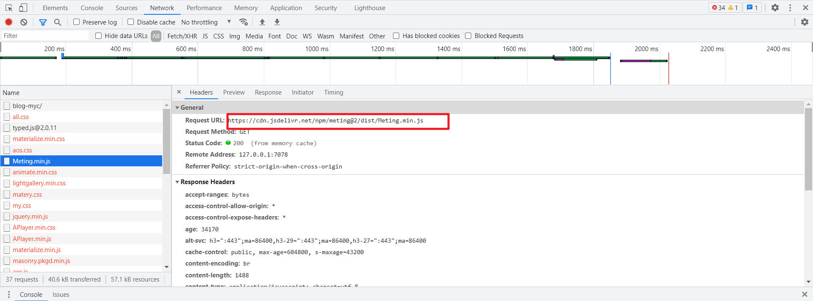
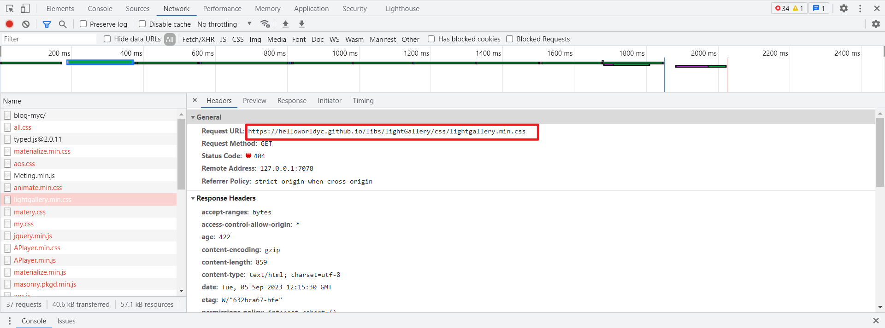

## 本地运行访问正常，部署到 github 上后加载不出 css 样式
问题如上，在本地能够正常访问，但是 `hexo d` 上传到 github 后，**能够访问页面但不能加载 CSS 样式文件**。  

### 分析
遇到这种能够访问页面但无法加载内容的问题，首先肯定是要用 F12   

请求成功的情况如图：
<div align="center"></div>
<!--  -->

而请求失败的情况则如图： 

<!--  -->

<div align="center"></div>

可以看到请求失败的响应码是 404，说明请求地址是有问题的。它请求的是 "helloworldyc.github.io/" 这个根目录下的资源，但是我们的博客项目的路径应该是 "helloworldyc.github.io/blog-myc/"，因此可以判断是 hexo 配置有问题。

### 解决方法
原来的 _config.yml 文件中设置的路径是：
```yml
url: https://helloworldyc.github.io/blog-myc
root: /
```

将其改为：
```yml
url: https://helloworldyc.github.io/
root: /blog-myc
```

`hexo clean` 后 `hexo g` 重新生成并部署到 github `hexo d`，重新刷新页面，可以发现页面加载没有问题。


## 图片加载问题
问题如上，`hexo g` 编译后访问文章**无法加载出来图片**。

### 分析一
**首先，查看其生成的 public 文件夹中是否有该图片。**找了一下，并没有发现该图片，说明 hexo 编译的时候没有将源文件夹中图片复制过去。

### 分析一的解决方法
1. 配置 _config.yml 中 `post_assert_folder`

```yml
# Writing
post_asset_folder: true
```

配置这个字段的意思是在 `hexo n "xxx.md"` 的时候在 _post 目录中生成对应的一个文件夹，用来存放这个文件的图片，hexo 在编译的时候会将这个文件的图片复制到对应 index 文件的同个目录下。

### 分析二
**其次，查看对应生成的 index.html 文件中对于图片的访问路径是否对应图片的实际路径。**  
如果没有安装 hexo-asset-image 插件，那么 hexo 编译后的路径是原封不动的，如下：

```html
<!-- 原来 md 中的图片地址 -->
<div align="center"></div>

<!-- hexo 编译后的图片访问地址 -->
<div align="center"></div>

<!-- 编译后正确的图片访问地址 -->
<div align="center"></div>
```

显然，编译后的图片访问地址是不正确的，hexo 编译过程没有转换，因此要安装 hexo-asset-image 插件。**这个插件的作用其实是进行一个代码的转换，也就是图片地址的转换**。

然而，即使安装了 hexo-asset-image 插件，hexo 编译后的地址还是有问题，如下：
```html
<!-- 原来 md 中的图片地址 -->
<div align="center"></div>

<!-- hexo 编译后的图片访问地址 -->
<div align="center"></div>

<!-- 编译后正确的图片访问地址 -->
<div align="center"></div>
```

可以看到，这个转换也是有问题的，因此我们还需要自己再修改插件的 js 文件。

### 分析二的解决方法
1. 安装 hexo-asset-image 插件：

```npm
npm install https://github.com/CodeFalling/hexo-asset-image --save

npm install hexo-asset-image --save
```

1. 修改 hexo-asset-image 插件的 js 源码，路径是 `/blog-myc/node_modules/hexo-asset-image/index.js`。然后对照自己的路径修改其第 58 行：  

```js
// 原来的代码是：
$(this).attr('src', config.root + link + src);

// 对照路径修改的代码：
$(this).attr('src', src);
```

### 图片在 md 文件中写法
这样子修改后，图片在 md 文件中写法如下：

```md
<div align="center"></div>


```

再重新编译访问，则没有问题了。  


<br>