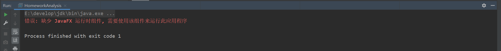
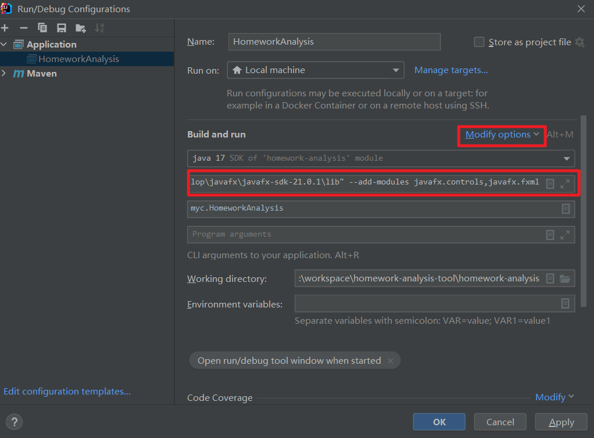
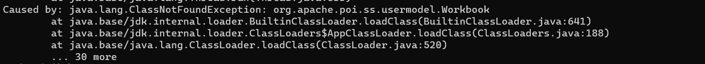
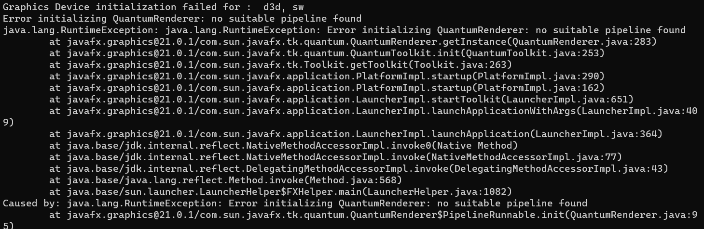

上一篇已经说了，我有个小工具用到了 JavaFX，在这过程中运行和打包时遇到了一些坑，在此记录。   


## 运行时遇到的坑

在运行 JavaFX 程序时，出现错误：缺少 JavaFX 运行时组件, 需要使用该组件来运行此应用程序，如下图：   

<div align="center"></div>

出现这个问题的原因是 JDK11 后，JavaFX 就从 JDK 剥离出来了，以独立的模块的形式提供，所以 JDK 中不包括 JavaFX 的运行时组件。   

知道了原因，解决起来就好办多了。既然 JDK 没有，那就提供呗，具体的解决方法如下：  

1. 下载 [JavaFX](https://gluonhq.com/products/javafx/) jar 包。里面有 jmod 和 SDK 两种下载，选择 SDK 方式。  
2. 在程序启动配置中添加 `VM options` 参数，将 JavaFX SDK 添加进去：`--module-path "E:\develop\javafx\javafx-sdk-21.0.1\lib" --add-modules javafx.controls,javafx.fxml`。  

<div align="center"></div>

这样，就可以顺利启动 JavaFX 程序了。


## 打包时遇到的坑

这里说的打包是指将 JavaFX 程序打成 jar 包并通过 JRE 成功运行，不是打成 exe 应用程序。关于打包成 exe 应用程序，可以看我 [Java jar 包打包成 exe 应用程序](https://helloworldyc.github.io/blog-myc/2024/01/08/Java-jar-%E5%8C%85%E6%89%93%E5%8C%85%E6%88%90-exe-%E5%BA%94%E7%94%A8%E7%A8%8B%E5%BA%8F/) 这篇文章。   

打成 jar 包大家应该都很熟悉，直接用 Maven Package 不就行了吗，这有什么坑？  
其实仔细想想，可以发现这里有两个问题，一是依赖，二是 JavaFX 运行时组件。为什么说这两个有坑，接下来详细说一下。  

### 问题一：依赖

我们知道，对于一个普通的 jar 包，我们要给别人使用，直接使用 Maven Package 打包后发给别人即可。但是，这是建立在对方有开发环境的前提下，对方可以直接导入我们所需的依赖。然而，JavaFX 程序并不是普通的 Java 程序，它很可能是给普通人使用的，也就是说对方没法导入我们所需的依赖。因此，我们需要将程序的依赖也打包进 jar 包中，否则最终用 JRE 运行 jar 包时很可能报 `ClassNotFoundException`，如下图所示。  

<div align="center"></div>

想将程序的依赖一起打包进 jar 包中，可以利用 `maven-assembly-plugin` 或者 `maven-shade-plugin` 插件，这里以程序中所用的 `maven-assembly-plugin` 来示例。  

在 pom 文件中，添加插件，如下：  
```xml
<build>
    <finalName>homework-analysis</finalName>
    <plugins>
        <plugin>
            <groupId>org.apache.maven.plugins</groupId>
            <artifactId>maven-assembly-plugin</artifactId>
            <version>3.3.0</version>
            <executions>
                <execution>
                    <phase>package</phase>
                    <goals>
                        <goal>single</goal>
                    </goals>
                    <configuration>
                        <archive>
                            <manifest>
                                <mainClass>myc.HomeworkAnalysis</mainClass>
                            </manifest>
                        </archive>
                        <descriptorRefs>
                            <descriptorRef>jar-with-dependencies</descriptorRef>
                        </descriptorRefs>
                    </configuration>
                </execution>
            </executions>
        </plugin>
    </plugins>
</build>
```

之后，再利用 maven package 打包，就可以得到一个包含了程序和依赖的 jar 包。  


### 问题二：JavaFX 运行时组件

大家应该还记得上面说的，JavaFX 程序运行前要添加 `VM options`，目的就是让程序运行时能找到 JavaFX 运行时组件。那我们打包后的 jar 包怎么能找到 JavaFX 运行时组件呢？从理论上来说，我们添加 `VM options` 实际上就是添加 jar 包或者说 jmod，那么我们是否能够直接将 JavaFX SDK 的 jar 包也一起打包到我们的 jar 包中呢？这个我还没有尝试过，还有待证明。我采用的是另一种方法——在 JRE 中添加。   

众所周知，要想运行一个 Java 程序，除了程序本身，还要有运行环境，也就是 JRE。既然没有将 JavaFX 运行时组件打包进我们的 jar 包中，那必然是要封装进 JRE。所幸，在 Java9 之后，有了模块化的概念，我们可以自定义所需的 JRE。关于模块化，可以看我另外一篇文章，这个不是本文的重点。这里主要说一下怎么将 JavaFX 运行时组件封装进 JRE，以及还有什么注意点。   

这个其实也不复杂，在自定义 JRE 时，将 JavaFX 的模块也封装进去就好了：  
```shell
jlink --module-path "E:\develop\javafx\javafx-sdk-21.0.1\lib" --add-modules [yourOtherDeps],javafx.base,javafx.graphics,javafx.controls --output custom-runtime
```

> 注意：`[yourOtherDeps]` 是程序所需的其他依赖，可通过 `jdeps` 命令确定。

这样，就得到了有 JavaFX 运行组件的 JRE。本来以为到这里就可以结束，但事实上这样子得到的 JRE 在运行 JavaFX jar 包的时候是会出现下图所示的错误的。  
<div align="center"></div>

这个错误直译就是由于找不到合适的管道导致图形化设备初始化失败，实际上就是由于封装的 JavaFX 运行时组件有问题导致的。这个错误困扰了我相当长一段时间，也尝试了网上所说的诸多解决方案，最终终于发现了问题所在。原来，我们在自定义 JRE 时导入的 JavaFX 模块是由 SDK 的 jar 包转换而来的，而 **JavaFX 运行时组件要想正确的封装进 JRE 中应该要导入官网提供的 jmod**。事实上，官网提供了 JavaFX 的 jmod 也正是为了让人能添加到自定义的 JRE 中。至于为什么通过 JavaFX SDK 封装的 JRE 有问题，我猜测可能是缺失了 module-info.java 文件或者是 module-info.java 文件中定义不全的缘故。   

既然知道了问题出现在哪里，当然就好解决了。从[官网](https://gluonhq.com/products/javafx/)下载 JavaFX jmod，将 `module-path` 换为 jmod 的路径即可，如下。  

```shell
jlink --module-path "E:\develop\javafx\javafx-jmods-21.0.1" --add-modules [yourOtherDeps],javafx.base,javafx.graphics,javafx.controls --output custom-runtime
```

最后，这样子得到的 JRE 用来运行我们打包的 JavaFX jar 包就没有问题了。